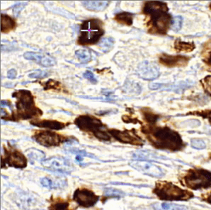
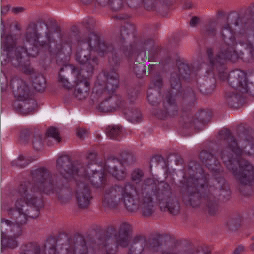
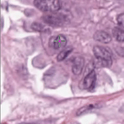

# NuClick++
 Clicks inside the nuclei or draw a scribble inside glands to obtain segmentation.
 
     
 ##Inference:
 Download weights for nucelues segmentation from [here]( https://drive.google.com/open?id=1MGjZs_-2Xo1W9NZqbq_5XLP-VbIo-ltA) and save it inside `weights` folder:
 * Set `application` in the `config.py` 
 * Run `test.py` to use the interface.
 
 To apply it on the existing detection points:
 * Save points in the `.mat` format: first column x 
 * Define directories in the `config.py`:  `mat_path = ''` ,  `images_path = ''` and `save_path = ''`
 * run `test_all_images`
 
