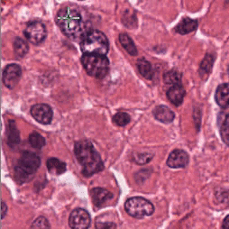

# NuClick
 Clicks inside the nuclei or draw a scribble inside glands to obtain segmentation.
 This is Keras implementation of NuClick ([link to paper ](https://arxiv.org/abs/2005.14511) )
 
 

## Dataset

The **datasets** released as part of NuClick paper are:

- Images of white blood cells (WBC) in blood sample images with their segmentation masks ([Download](https://warwick.ac.uk/fac/sci/dcs/research/tia/data/nuclick/hemato_data.zip))
- Datasets of lymphocyte segmentation in Immunohistochemistry (IHC) images ([Download](https://warwick.ac.uk/fac/sci/dcs/research/tia/data/nuclick/ihc_nuclick.zip))

## Requirements

`Keras==2.2.4
h5py==2.9.0
opencv_python_headless==4.1.0.25
pandas==0.25.1
matplotlib==3.1.1
six==1.12.0
tensorflow_gpu==1.13.1
scipy==1.3.0
numpy==1.17.0
albumentations==0.3.1
scikit_image==0.15.0
Pillow==8.0.1
skimage==0.0
tensorflow==2.4.0`

 ## Inference:
 Download weights for nucleus segmentation from [here]( https://drive.google.com/open?id=1MGjZs_-2Xo1W9NZqbq_5XLP-VbIo-ltA) and save it inside `weights` folder:
 * Set `application` in the `config.py` 
 * Run `test.py` to use the interface.
 
 To apply it on the existing detection points:
 * Save points in the `.mat` format: first column x 
 * Define directories in the `config.py`:  `mat_path = ''` ,  `images_path = ''` and `save_path = ''`
 * run `test_all_images`
 
